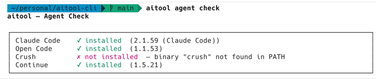

# aitool-cli

> A CLI tool built with [Ink](https://github.com/vadimdemedes/ink) and compiled to standalone binaries
> via [Bun](https://bun.sh).

## Quickstart

```bash
curl -fsSL https://raw.githubusercontent.com/ShawInnes/aitool-cli/main/scripts/install.sh | sh

aitool agent check
```



## Install

**macOS / Linux:**

```sh
curl -fsSL https://raw.githubusercontent.com/ShawInnes/aitool-cli/main/scripts/install.sh | sh
```

**Windows (PowerShell):**

```powershell
irm https://raw.githubusercontent.com/ShawInnes/aitool-cli/main/scripts/install.ps1 | iex
```

### Manual download

Download the binary that matches your platform from
the [latest release](https://github.com/ShawInnes/aitool-cli/releases/latest):

| Platform      | Archive                      |
| ------------- | ---------------------------- |
| macOS (Apple) | `aitool-darwin-arm64.tar.gz` |
| macOS (Intel) | `aitool-darwin-x64.tar.gz`   |
| Linux (x64)   | `aitool-linux-x64.tar.gz`    |
| Linux (ARM64) | `aitool-linux-arm64.tar.gz`  |
| Windows (x64) | `aitool-win-x64.zip`         |
| Windows (ARM) | `aitool-win-arm64.zip`       |

Then extract and move the binary onto your PATH:

```bash
tar xzf aitool-darwin-arm64.tar.gz
chmod +x aitool-darwin-arm64
mv aitool-darwin-arm64 /usr/local/bin/aitool
```

A `checksums.txt` file is included with each release so you can verify the download:

```bash
# Download checksums
curl -fsSL https://github.com/ShawInnes/aitool-cli/releases/latest/download/checksums.txt -o checksums.txt

# Verify (Linux)
sha256sum --check --ignore-missing checksums.txt

# Verify (macOS)
shasum -a 256 --check --ignore-missing checksums.txt
```

### Windows

Download `aitool-win-x64.exe` (or `aitool-win-arm64.exe`) from
the [latest release](https://github.com/ShawInnes/aitool-cli/releases/latest), rename it to `aitool.exe`, and add its
location to your `PATH`.

## Update

### Self-update (macOS / Linux)

The binary can update itself in place:

```bash
aitool update
```

This checks GitHub for a newer release, downloads the matching binary, verifies its checksum, and atomically replaces
the running binary. Restart your shell afterward.

### Self-update (Windows)

The self-updater downloads the new binary alongside the current one and prints the rename command needed to complete the
update (Windows does not allow overwriting a running executable).

### Re-run the install script

Running the install script again will always fetch and install the latest version:

```bash
# macOS / Linux
curl -fsSL https://raw.githubusercontent.com/ShawInnes/aitool-cli/main/scripts/install.sh | sh

# Windows (PowerShell)
irm https://raw.githubusercontent.com/ShawInnes/aitool-cli/main/scripts/install.ps1 | iex
```

## CLI

```
Usage
  $ aitool [command]

Commands
  agent     Manage and check AI coding agents
  skills    Manage agent skills
  update    Update to the latest version
  version   Print the current version

Options
  --json    Output as JSON
  --tui     Force TUI rendering

Examples
  $ aitool agent check
  $ aitool skills install https://github.com/org/my-skills.git
  $ aitool skills update
  $ aitool version
  $ aitool update
```

## Managing Skills

Skills are reusable instruction sets for AI coding agents. The `skills` command installs them from
a Git repository and symlinks them into `~/.claude/skills/` and `~/.agents/skills/` so agents can
discover and use them.

### Install skills from a repo

```bash
aitool skills install https://github.com/org/my-skills.git
# or via SSH
aitool skills install git@github.com:org/my-skills.git
```

The repo is cloned into `~/.agent-skills/<repo-name>` and each skill is symlinked into the agent
skill directories. Re-running install on an already-present skill is safe — existing links are
skipped.

### Update installed skills

```bash
aitool skills update
```

Pulls the latest changes for every installed skills repo and links any newly added skills.

### Skills repo structure

A skills repository only needs a top-level `skills/` folder. Each subdirectory inside it is one
skill:

```
my-skills/
└── skills/
    ├── commit/
    │   └── SKILL.md
    ├── testing/
    │   └── SKILL.md
    └── code-review/
        └── SKILL.md
```

Each `SKILL.md` has a short YAML front matter block followed by the skill's instructions:

```markdown
---
name: commit
description: Create a git commit with a conventional commit message
---

## Instructions

...
```

That's the full required structure — no config files, manifests, or build steps needed.

## Releases

Releases are automated via GitHub Actions. To publish a new version:

1. Bump the version in `package.json`
2. Commit and push
3. Create and push a tag:

```bash
git tag v1.2.3
git push origin v1.2.3
```

The [release workflow](.github/workflows/release.yml) will build binaries for all six platforms, generate
`checksums.txt`, and publish a GitHub Release automatically.

## Development

```bash
bun install
bun run dev
```

Build all platform binaries:

```bash
bun run build:all
```


### Experiment - BD/Beads for Issue Tracking

sudo bash -c 'curl -L https://github.com/dolthub/dolt/releases/latest/download/install.sh | bash'
curl -fsSL https://raw.githubusercontent.com/steveyegge/beads/main/scripts/install.sh | bash
